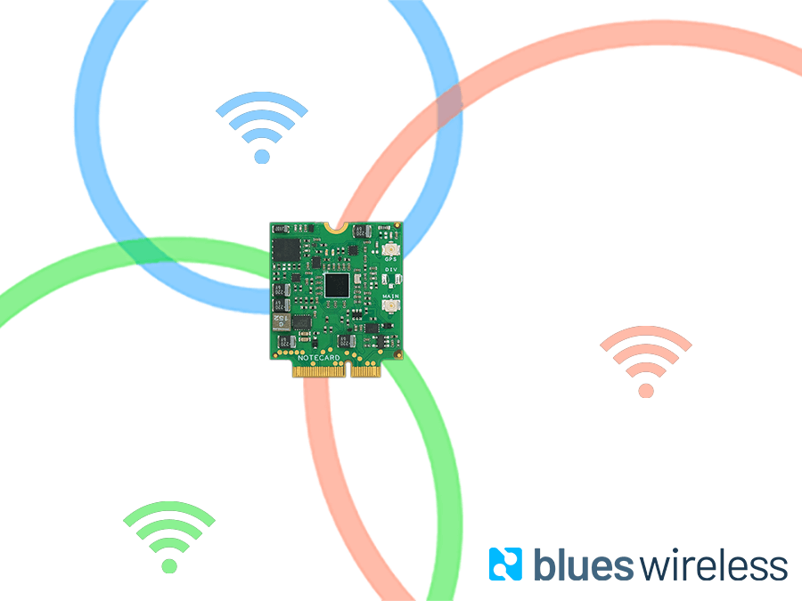

# Indoor Asset Tracking with CircuitPython

Learn how to build an indoor asset tracking solution with CircuitPython and the 
[Blues Wireless Notecard](https://blues.io/products/notecard/) in this 
[tutorial on Hackster](TODO).

## Hardware

- [Blues Wireless Cellular Notecard](https://blues.io/products/notecard/)
- [Blues Wireless Notecarrier-F](https://blues.io/products/notecarrier/notecarrier-f/)
- [Adafruit BME280](https://www.adafruit.com/product/2652)
- [Adafruit ESP32-S2 Feather](https://www.adafruit.com/product/5000)

## Software/Services

- [CircuitPython](https://circuitpython.org/)
- [Blues Wireless Notehub](https://blues.io/products/notehub/)
